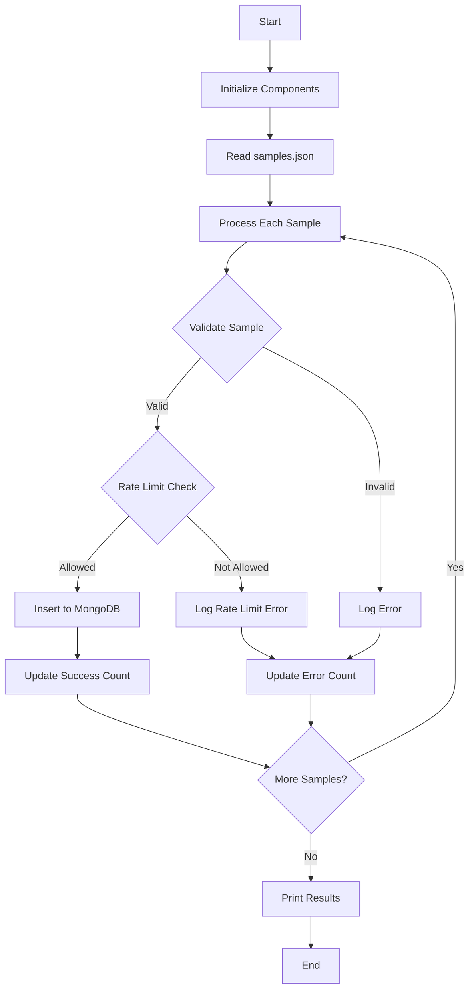
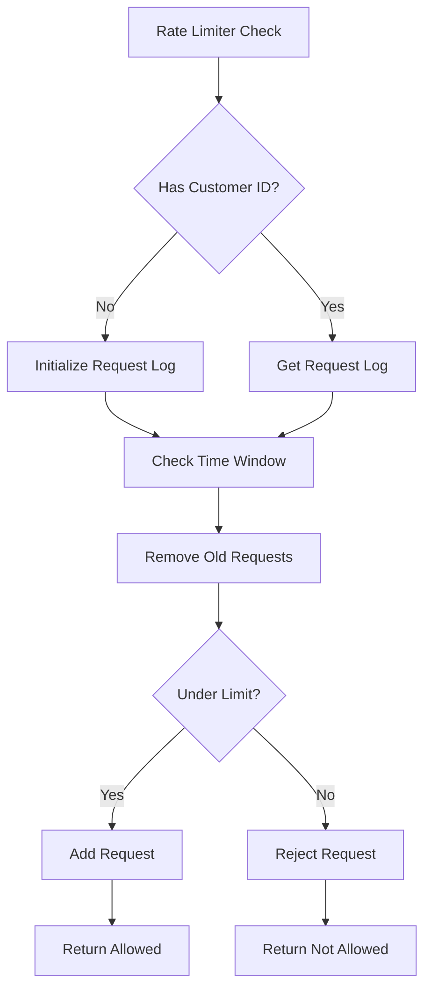
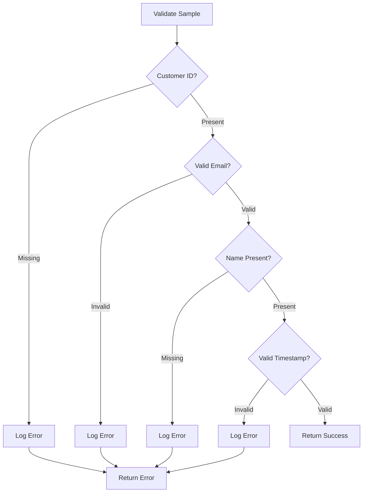
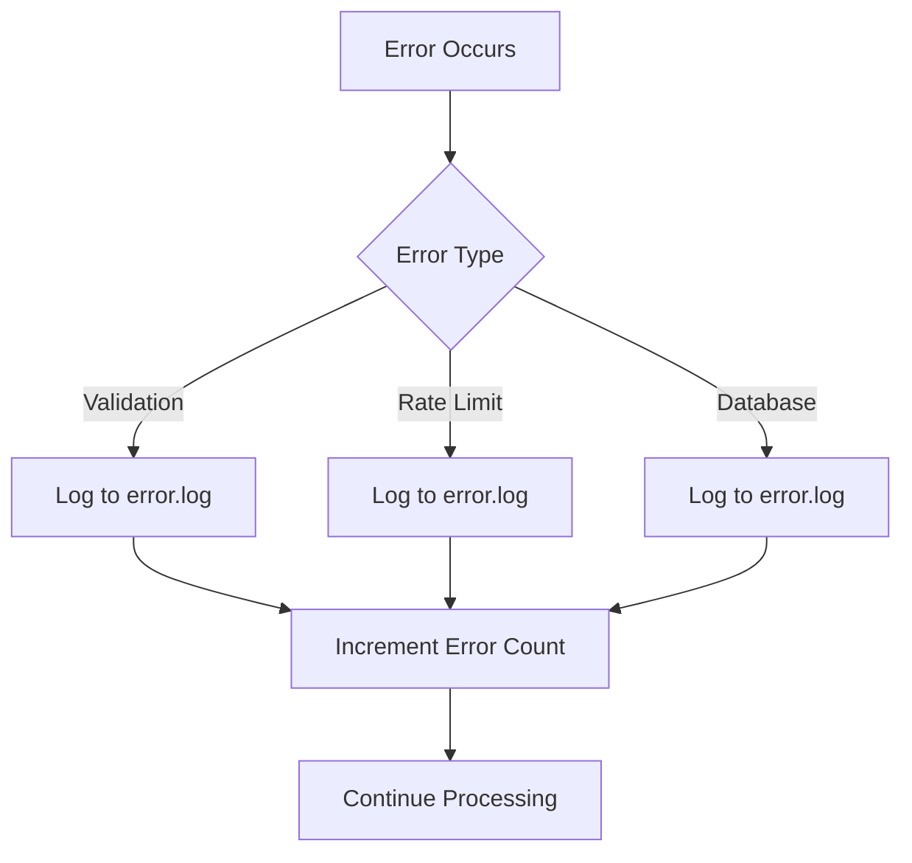
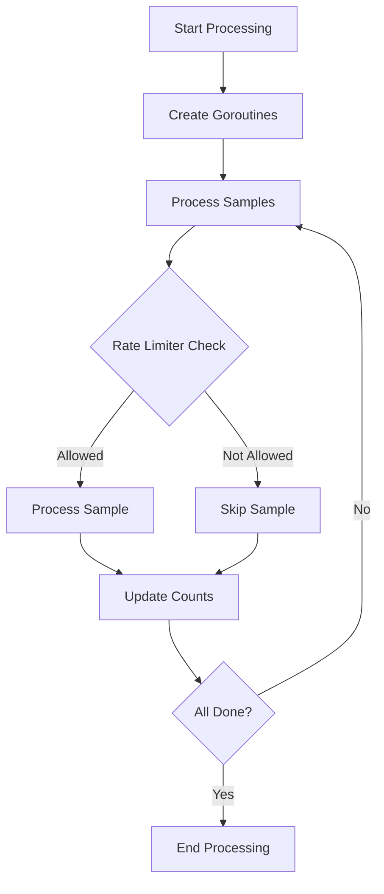

# Application Flow

## Main Flow

```mermaid
graph TD
    A[Start] --> B[Initialize Components]
    B --> C[Read samples.json]
    C --> D[Process Each Sample]
    D --> E{Validate Sample}
    E -->|Valid| F{Rate Limit Check}
    E -->|Invalid| G[Log Error]
    F -->|Allowed| H[Insert to MongoDB]
    F -->|Not Allowed| I[Log Rate Limit Error]
    H --> J[Update Success Count]
    G --> K[Update Error Count]
    I --> K
    J --> L{More Samples?}
    K --> L
    L -->|Yes| D
    L -->|No| M[Print Results]
    M --> N[End]
```

## Rate Limiter Flow

```mermaid
graph TD
    A[Rate Limiter Check] --> B{Has Customer ID?}
    B -->|No| C[Initialize Request Log]
    B -->|Yes| D[Get Request Log]
    C --> E[Check Time Window]
    D --> E
    E --> F[Remove Old Requests]
    F --> G{Under Limit?}
    G -->|Yes| H[Add Request]
    G -->|No| I[Reject Request]
    H --> J[Return Allowed]
    I --> K[Return Not Allowed]
```

## Validation Flow

```mermaid
graph TD
    A[Validate Sample] --> B{Customer ID?}
    B -->|Missing| C[Log Error]
    B -->|Present| D{Valid Email?}
    D -->|Invalid| E[Log Error]
    D -->|Valid| F{Name Present?}
    F -->|Missing| G[Log Error]
    F -->|Present| H{Valid Timestamp?}
    H -->|Invalid| I[Log Error]
    H -->|Valid| J[Return Success]
    C --> K[Return Error]
    E --> K
    G --> K
    I --> K
```

## Error Handling Flow

```mermaid
graph TD
    A[Error Occurs] --> B{Error Type}
    B -->|Validation| C[Log to error.log]
    B -->|Rate Limit| D[Log to error.log]
    B -->|Database| E[Log to error.log]
    C --> F[Increment Error Count]
    D --> F
    E --> F
    F --> G[Continue Processing]
```

## Concurrent Processing Flow

```mermaid
graph TD
    A[Start Processing] --> B[Create Goroutines]
    B --> C[Process Samples]
    C --> D{Rate Limiter Check}
    D -->|Allowed| E[Process Sample]
    D -->|Not Allowed| F[Skip Sample]
    E --> G[Update Counts]
    F --> G
    G --> H{All Done?}
    H -->|No| C
    H -->|Yes| I[End Processing]
``` 